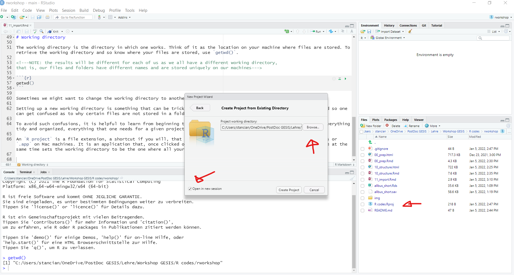

```{r, echo=FALSE, include=FALSE}
## code to set up the cran mirror
## needed to download needed packages into R
r <- getOption("repos")
r["CRAN"] <-"https://cloud.r-project.org/"
options(repos=r)

## code that first checks whether a package is required and installed,
## and if not it will install it 

# package haven is usefull to read spss .sav data formats
if (!require(haven)) {
    install.packages("haven")
    require(haven)
}
# package tidyverse contains a series of helpful functions that 
# are used to filter, group, manipulate data
if (!require(tidyverse)) {
    install.packages("tidyverse")
    require(tidyverse)
}

# package dplyr contains yet another set of helpful functions
if (!require(dplyr)) {
    install.packages("dplyr")
    require(dplyr)
}

## once packages are installed, they need to be activated,
# otherwise the user has no access to the functions included

library("haven")
library("tidyverse")
library("dplyr")
```

___
Importing data into R is a relevant first step towards using R to analyze, visualize, and present your data. As simple as this may seem, already at this stage there can be complications arising due to the nature of data one has, as well as where the data is stored, whether in the working directory or not. 

There are several aspects one needs to become familiarized with before starting the data importing process. 

# Working directory

The working directory is the directory in which one works. Think of it as the location on your machine where files are stored. To retrieve the working directory and so know where your files are stored, use `getwd()`.

<!---NOTE: the results will be different for each of us as we all have a different working directory,
that is, our files and folders have different names and are stored uniquely on our machines--->

```{r}
getwd()
```

Sometimes we might want to change the working directory to another. The function `setwd()` can be used. 

<!--- #RS# important point here: setwd() works really badly in RMDs and can cause lots of strange bugs
With RMD files, I would always work in relation to the RMD file.
Or, as you say, in relation to a project or package.
--->

Setting up a new working directory is something that can be tricky, as over time one can forget about ever doing this and so one can get confused as to why certain files are not stored in a folder that one usually uses. 

To avoid such confusions, it is helpful to learn from beginning to work with `R projects`, which is one way of keeping everything tidy and organized, everything that one needs for a given project, including data, R scripts, and so on. 

An `R project` is a file extension, a shortcut if you will, that functions much like the `.exe` files on Windows machines or `.app` on Mac machines. It is an application that, once clicked on, will open the containing folder on your machine while at the same time sets the working directory to be the one where all your files are stored. 

To create an `R project` for the seminar, follow the steps below:

1. In the RStudio, find the button **File**, click it and navigate from the list to **New project**. Click it and a new window will be shown, much like this one: 
2. Choose either to create a project by associating it with a new directory (option 1) or with an existent directory (option 2). Choose option 2 if on your machine there is already a folder where you've stored the ALLBUS data, the .Rmds and any other relevant files for the seminar. If you choose this option, it will look very much like this: 
3. For option 2 above: Using **Browse** button, navigate on your machine and select the containing folder. Make sure you have selected the option "Open in new session" in the lower left corner. Once you are done, click on `create project`. 
4. A new Rstudio session will now be opened and you will see, as shown in the image above, on the lower right corner the contents of your folder (what is stored on your machine). There you will see a a new file that has the extension `.Rproj`. This is the extension file that you can use to directly open your working project. 

Now that you've created your project, you can check that the working directory is the same as the containing folder on your local machine. 

```{r}
getwd()
```

# Paths

At times we might choose to store the original data somewhere else on your local machine, read it into R, manipulate it (shorten it, perform operations, etc.) and then save the newly created data in the working directory. 

The `00_prep.Rmd` shows step by step how this can be done using the ALLBUS data downloaded from the GESIS website [see here](https://search.gesis.org/research_data/ZA5273).

Paths in `R` are absolute or relative. Absolute paths are fixed, and need to always be precisely identical, otherwise certain code might not function. This is usually a problem if you share the code with colleagues who might want to re-run the code on their local machines. An absolute path is similar to the one you've retrieved above with the command `getwd()`.

Relative paths are more flexible and can be smoothly integrated with the `R project`. That is, when working in `RStudio`, the software uses the working directory as the default directory and searches files there. However, one can up even more the organization game and create sub-folders inside the working directory. These folders then have a so-called relative path to your working directory. 

See this image: 

The red arrow points at a sub-folder inside my working directory and so if I want to call or retrieve its contents I have to specify this path. 

# Data importing

Let's say that the short ALLBUS data in the format `.Rds` is stored in my working directory, and in the format `.sav` and `.xlsx` in a sub-folder called "data".

Please note, the two data extensions use different ways to be read into R!

```{r}
# reads the .Rds from the workind directory
df_1 <- readRDS("allbus_short.Rds")

# reads the .sav from the sub-folder "data" in the working directory
df_2 <- haven::read_sav("data/allbus_short.sav", user_na = TRUE)

# reads the .xlsx from the sub-folder "data" in the working directory
df_3 <- readxl::read_excel("data/allbus_short.xlsx")
```

You can call in the empty R code chunk below all three versions of the data frame.

```{r}

```

Now that we have the data imported in R, we can use some of the commands we've learned in `10_structure.Rmd` to visualize the contents.

Using the empty R code chunk below, use the commands as you'd like. Since both `df_1` and `df_2` are identical, you can choose to work with one or the other, or if you'd want to double check use the same commands on both data frames.

```{r}

```

- `names()`: lists all variable names
- `length()` or `ncol()`: returns the number of columns/variables
- `nrow()`: returns the number of rows/observations
- `head()`: prints an excerpt of the data frame, the first few observations
- `tail()`: prints an excerpt of the data frame, the last few observations
- `view()`: opens Rstudio's data view (very similar to SPSS data view)
- `glimpse()`: lists variables and gives a preview of their contents vertically

Note however, that `df_3` is only seemingly identical to the other two!

<!---the text between <center> and </center> is still regular text in Rmarkdown,
but the difference from the text we've seen so far is that this one uses also html formatting,
which is the two center words.

html formatting is common for improving page structuring or enhancing visualization. 
This however only works when knitting an Rmarkdown as html.--->

<!---knitting in Rmarkdown is a way to automatically transform the contents written in the Rmarkdown document into different formats, such as html (for internat usability), word documents, pdf documents, and so on. Note however, that depending on which format you want to knit, there might be different rules/hidden commands or code you need to use to make the final file look the way you want it to look.

As a start, google "Rmarkdown knit into pdf" or "Rmarkdown knit into html" and see the differences.--->

<center>

**Can you spot the difference?**

</center>

Hint: This is the topic for the next session.


